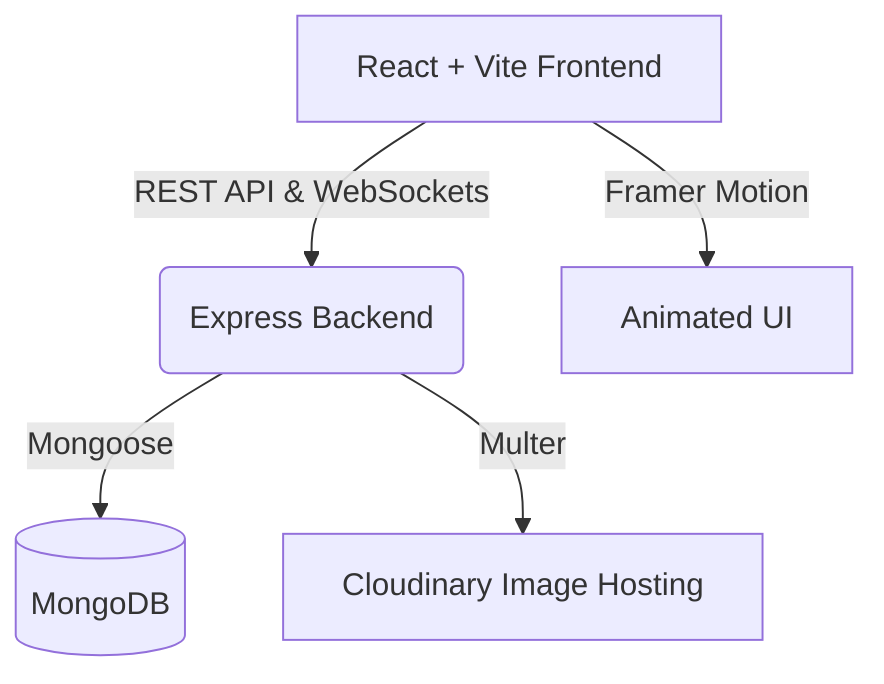

<div align="center">
  
</div>

<h1 align="center">CampusLoop 🚀</h1>

<p align="center">
  <a href="https://reactjs.org/"></a>
  <a href="https://nodejs.org/"></a>
  <a href="https://expressjs.com/"></a>
  <a href="https://www.mongodb.com/"></a>
  <a href="https://tailwindcss.com/"></a>
  <a href="https://socket.io/"></a>
</p>

<p align="center">
  <em>A secure, dynamic, and real-time marketplace built exclusively for university students. Buy, sell, and connect seamlessly on campus.</em>
</p>

---

## ✨ Features

<details>
<summary><strong>🔐 Secure Student Authentication</strong></summary>
<br>
Exclusive access using JWT authentication. Only verified university students can join the platform, ensuring a safe trading environment.
</details>

<details>
<summary><strong>💬 Real-Time Chat (Socket.io)</strong></summary>
<br>
Negotiate and connect instantly with buyers and sellers through a real-time messaging system powered by Socket.io.
</details>

<details>
<summary><strong>📸 Cloud Media Management</strong></summary>
<br>
Seamless image uploads using Multer and Cloudinary. Fast, optimized, and reliable image delivery for your listings.
</details>

<details>
<summary><strong>🎨 Modern & Animated UI</strong></summary>
<br>
A beautiful, responsive user interface built with TailwindCSS and Framer Motion for smooth page transitions and micro-interactions.
</details>

<details>
<summary><strong>🚀 Blazing Fast Performance</strong></summary>
<br>
Powered by Vite on the frontend and an optimized Express/Mongoose backend for rapid load times and database queries.
</details>

---

## 🏗️ Architecture



---

## 💻 Tech Stack

### Frontend
- **Framework:** React 19 + Vite
- **Styling:** Tailwind CSS + PostCSS
- **Animations:** Framer Motion
- **Routing:** React Router DOM
- **Icons:** Lucide React
- **HTTP Client:** Axios
- **WebSockets:** Socket.io-client

### Backend
- **Runtime:** Node.js
- **Framework:** Express.js
- **Database:** MongoDB (Mongoose)
- **Authentication:** JWT + Bcryptjs
- **WebSockets:** Socket.io
- **File Uploads:** Multer + Cloudinary Storage

---

## 🚀 Getting Started

### Prerequisites
Make sure you have [Node.js](https://nodejs.org/) and [npm](https://npmjs.com/) installed on your machine.

### Installation

1. **Clone the repository**
   ```bash
   git clone https://github.com/raghavendra-kumar04/CampusLoop.git
   cd CampusLoop
   ```

2. **Setup Backend**
   <details>
   <summary>Click to view backend setup steps</summary>
   
   ```bash
   cd backend
   npm install
   ```
   Create a `.env` file in the `backend` directory based on `.env.example` and add your MongoDB URI, Cloudinary credentials, and JWT secret.
   
   ```bash
   npm run dev
   ```
   </details>

3. **Setup Frontend**
   <details>
   <summary>Click to view frontend setup steps</summary>
   
   ```bash
   cd frontend
   npm install
   ```
   
   ```bash
   npm run dev
   ```
   </details>

---

## 💡 How It Works

<div align="center">
  
</div>

1. **Sign Up:** Register with your student credentials.
2. **List Items:** Upload images and details of items you want to sell.
3. **Discover:** Browse listings across different categories on your campus.
4. **Connect:** Use the built-in chat to negotiate and arrange meetups.

---

<div align="center">
  <p>Built with ❤️ by the CampusLoop Team.</p>
  
</div>
